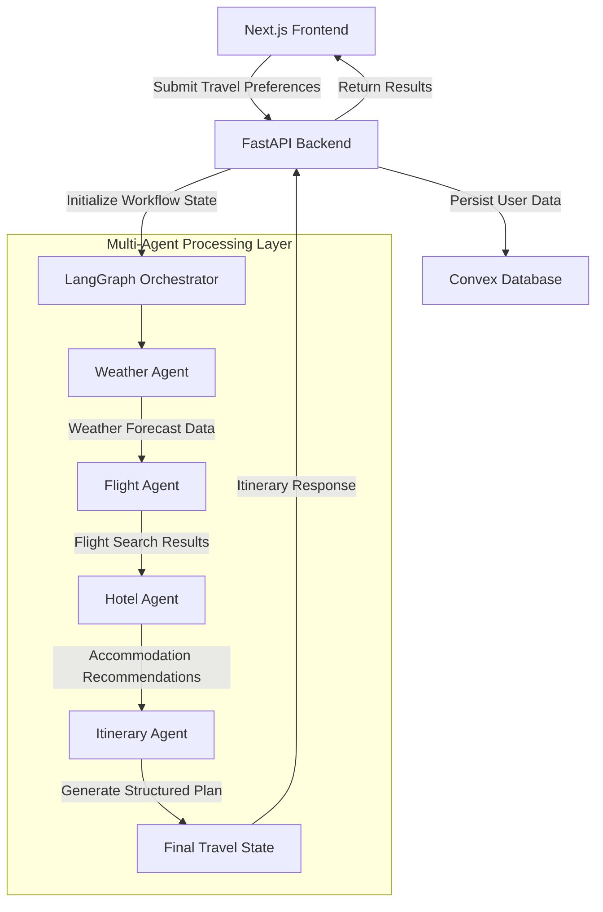

# AI-Powered Multi-Agent Travel Planner

An intelligent travel planning platform that combines multi-agent AI workflows, real-time travel data, and personalized recommendations to generate complete trip itineraries tailored to user preferences and budgets.

The application automates destination research, flight discovery, accommodation recommendations, and itinerary generation through a coordinated LangGraph-based orchestration system.

An advanced, full-stack travel planning application powered by a custom multi-agent LangGraph system that automates destination research, lodging lookups, flight aggregation, and day-by-day itinerary synthesis based on user constraints, travel companions, and dynamic budgets.

---

## 🚀 Key Features


### AI-Powered Multi-Agent Planning

### AI-Powered Multi-Agent Planning

Built on a stateful LangGraph workflow that coordinates independent weather, flight, hotel, and itinerary agents. Each agent specializes in a distinct task and contributes structured outputs that are combined into a unified travel plan using Gemini 2.5 Flash.

### Real-Time Travel Intelligence

Integrates external travel and weather providers to retrieve current destination conditions, flight availability, and hotel information. This ensures recommendations are generated using live data rather than static datasets.

### Smart Flight Search

Supports one-way and round-trip travel planning while automatically resolving nearby cities and suburban regions to the nearest active commercial airport. This improves flight coverage and reduces user input complexity.

### Adaptive Traveler Profiles

Dynamically generates traveler input forms for solo travelers, couples, families, and groups. Additional traveler details help produce more realistic budget calculations and trip recommendations.

### Day-Wise Stay and Meal Planning

Generates a structured travel timeline that includes accommodation details and suggested meal schedules for breakfast, lunch, and dinner throughout the trip.

### Budget Estimation Dashboard

Provides a detailed cost summary covering flights, accommodation, food, and activities, allowing users to understand expected travel expenses at a glance.

### Voice-Based Input

Enables itinerary creation through voice commands using the **Web Speech API**, with built-in browser permission handling and user guidance.

### Printable PDF-Friendly Layout

Includes dedicated print styling that converts itineraries into a clean, high-contrast travel booklet optimized for PDF export and physical printing.

### Secure User Data Management

Uses **Clerk Authentication** and ownership-based access controls to ensure users can only access and manage their own saved itineraries.

### Administrative Insights Panel

Offers a live dashboard for administrators to monitor registered users, stored itineraries, and platform activity in real time.


---

## 🛠️ Technology Stack

### **Frontend (Next.js Application)**
* **Framework**: Next.js 16 (App Router) & React 19
* **Language**: TypeScript
* **Styling**: Vanilla CSS (sleek dark mode glassmorphism)
* **Auth**: Clerk Authentication
* **Mapping**: React Leaflet & Leaflet (OpenStreetMap coordinates)
* **Database**: Convex (real-time reactive database syncing client states)

### **Backend (Python Orchestrator)**
* **Framework**: FastAPI (Uvicorn server)
* **Workflow Engine**: LangGraph & LangChain
* **LLM**: Gemini 2.5 Flash (`gemini-2.5-flash`)
* **Local Database**: SQLite (SQLAlchemy ORM for quick caching)
* **APIs**:
  * **SerpApi**: Google Flights Engine & Google Hotels Engine
  * **OpenWeatherMap**: Current weather and conditions
  * **Nominatim**: OpenStreetMap geographical city search

---

## 📐 System Architecture

The platform follows a stateful, multi-agent architecture where specialized agents independently gather travel intelligence before a centralized orchestrator combines the results into a unified itinerary.



### Workflow Overview

1. The user submits travel preferences through the **Next.js frontend**.
2. The **FastAPI backend** initializes a workflow state and triggers the LangGraph orchestration engine.
3. The **Weather Agent** gathers destination-specific weather forecasts and seasonal insights.
4. The **Flight Agent** retrieves flight options, routes, and fare information from external travel APIs.
5. The **Hotel Agent** collects accommodation recommendations based on destination, dates, and budget constraints.
6. The **Itinerary Agent** combines all gathered information and generates a structured day-by-day travel plan.
7. The finalized itinerary is stored in the **Convex database** and linked to the authenticated user account.
8. The complete travel plan is returned to the frontend for visualization, editing, and export.

```
```

```

### Agent Responsibilities

#### Weather Agent
Retrieves weather forecasts and environmental conditions relevant to the selected destination.

#### Flight Agent
Discovers suitable flight routes, airport mappings, and pricing information for the requested travel dates.

#### Hotel Agent
Collects accommodation recommendations and pricing data that align with the user's budget and trip duration.

#### Itinerary Agent
Aggregates outputs from all previous agents and generates a structured day-by-day travel schedule.
---

## ⚙️ Environment Setup

Create a `.env.local` file in the root folder and a `.env` file in the `backend/` folder.

### **Next.js (`.env.local`)**
```env
NEXT_PUBLIC_CLERK_PUBLISHABLE_KEY=your_clerk_publishable_key
CLERK_SECRET_KEY=your_clerk_secret_key
NEXT_PUBLIC_CLERK_SIGN_IN_URL=/sign-in
NEXT_PUBLIC_CLERK_SIGN_UP_URL=/sign-up
NEXT_PUBLIC_CLERK_AFTER_SIGN_IN_URL=/
NEXT_PUBLIC_CLERK_AFTER_SIGN_UP_URL=/
NEXT_PUBLIC_CONVEX_URL=your_convex_url
NEXT_PUBLIC_MAPBOX_ACCESS_TOKEN=your_mapbox_token
GEMINI_API_KEY=your_gemini_api_key
ARCJET_KEY=your_arcjet_key
RESEND_API_KEY=your_resend_api_key
```

### **FastAPI Backend (`backend/.env`)**
```env
OPENWEATHERMAP_API_KEY=your_openweathermap_key
SERPAPI_API_KEY=your_serpapi_key
GEMINI_API_KEY=your_gemini_api_key
```

---

## 🏃 Running Locally

### **1. Setup Convex Database**
Ensure you have the Convex server running:
```bash
npx convex dev
```

### **2. Run Next.js Frontend**
Install dependencies and run the development server:
```bash
npm install
npm run dev
```
Open [http://localhost:3000](http://localhost:3000) in your browser.

### **3. Run FastAPI Backend**
Navigate to the `backend/` folder, activate your virtual environment, install requirements, and run the server:
```bash
cd backend
source venv/bin/activate  # On Windows: .\venv\Scripts\activate
pip install -r requirements.txt
uvicorn main:app --reload
```
The API server will run at [http://127.0.0.1:8000](http://127.0.0.1:8000).

---

### Deployment Strategy

- Frontend services are deployed on Vercel for fast global content delivery.
- Convex provides real-time database synchronization and backend persistence.
- Clerk manages user authentication and access control.
- FastAPI services can be deployed independently to support scalable AI workflow execution.
