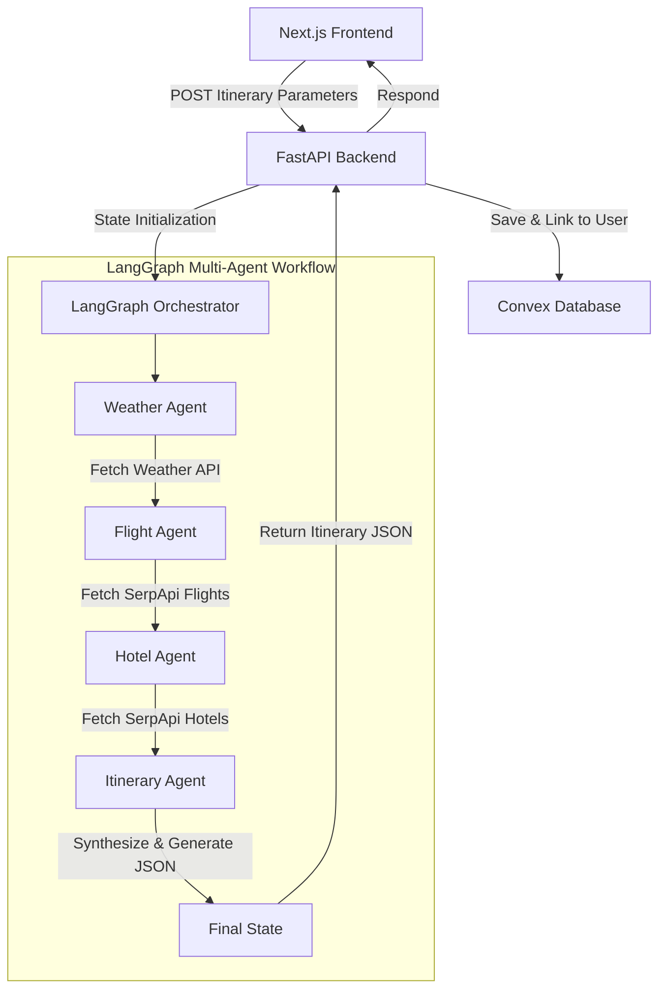

# AI-Powered Multi-Agent Travel Planner

A modern travel planning app that combines AI agents, live travel data, and personalized itinerary generation to help users book smarter journeys.

An advanced, full-stack travel planning application powered by a custom multi-agent LangGraph system that automates destination research, lodging lookups, flight aggregation, and day-by-day itinerary synthesis based on user constraints, travel companions, and dynamic budgets.

---

## 🚀 Key Features

## Key Features

### AI-Powered Multi-Agent Planning

Leverages a stateful **LangGraph** workflow that coordinates multiple specialized agents for weather forecasting, flight discovery, hotel recommendations, and itinerary generation. The final travel plan is synthesized using **Gemini 2.5 Flash**.

### Real-Time Travel Intelligence

Fetches live weather updates and travel information through integrations with **OpenWeatherMap** and **SerpApi**, providing current flight fares, hotel availability, and destination conditions.

### Smart Flight Search

Supports both **one-way** and **round-trip** journeys. The system automatically maps nearby cities and suburbs such as Navi Mumbai, Noida, and Gurgaon to the closest operational airport hubs, ensuring accurate route selection.

### Adaptive Traveler Profiles

Dynamically generates traveler input forms for solo travelers, couples, families, and groups. Additional traveler details help produce more realistic budget calculations and trip recommendations.

### Day-Wise Stay and Meal Planning

Generates a structured travel timeline that includes accommodation details and suggested meal schedules for breakfast, lunch, and dinner throughout the trip.

### Budget Estimation Dashboard

Provides a detailed cost summary covering flights, accommodation, food, and activities, allowing users to understand expected travel expenses at a glance.

### Voice-Based Input

Enables itinerary creation through voice commands using the **Web Speech API**, with built-in browser permission handling and user guidance.

### Printable PDF-Friendly Layout

Includes dedicated print styling that converts itineraries into a clean, high-contrast travel booklet optimized for PDF export and physical printing.

### Secure User Data Management

Uses **Clerk Authentication** and ownership-based access controls to ensure users can only access and manage their own saved itineraries.

### Administrative Insights Panel

Offers a live dashboard for administrators to monitor registered users, stored itineraries, and platform activity in real time.


---

## 🛠️ Technology Stack

### **Frontend (Next.js Application)**
* **Framework**: Next.js 16 (App Router) & React 19
* **Language**: TypeScript
* **Styling**: Vanilla CSS (sleek dark mode glassmorphism)
* **Auth**: Clerk Authentication
* **Mapping**: React Leaflet & Leaflet (OpenStreetMap coordinates)
* **Database**: Convex (real-time reactive database syncing client states)

### **Backend (Python Orchestrator)**
* **Framework**: FastAPI (Uvicorn server)
* **Workflow Engine**: LangGraph & LangChain
* **LLM**: Gemini 2.5 Flash (`gemini-2.5-flash`)
* **Local Database**: SQLite (SQLAlchemy ORM for quick caching)
* **APIs**:
  * **SerpApi**: Google Flights Engine & Google Hotels Engine
  * **OpenWeatherMap**: Current weather and conditions
  * **Nominatim**: OpenStreetMap geographical city search

---

## 📐 System Architecture

The travel planner utilizes a stateful multi-agent system coordinating independent data-gathering nodes before synthesizing the final itinerary:



### **Agent Explanations**
1. **Weather Agent**: Calls OpenWeatherMap API to get the current temperature and conditions at the destination.
2. **Flight Agent**: Identifies destination airport codes (resolving cities to their nearest active commercial airports) and pulls live flight schedules and prices (one-way or round-trip).
3. **Hotel Agent**: Queries live lodging prices matching the check-in/check-out calendar dates.
4. **Itinerary Orchestrator**: Aggregates all agent outputs, matches them against user budget constraints and companion preferences, and compiles them into a geographically precise day-by-day schedule.

---

## ⚙️ Environment Setup

Create a `.env.local` file in the root folder and a `.env` file in the `backend/` folder.

### **Next.js (`.env.local`)**
```env
NEXT_PUBLIC_CLERK_PUBLISHABLE_KEY=your_clerk_publishable_key
CLERK_SECRET_KEY=your_clerk_secret_key
NEXT_PUBLIC_CLERK_SIGN_IN_URL=/sign-in
NEXT_PUBLIC_CLERK_SIGN_UP_URL=/sign-up
NEXT_PUBLIC_CLERK_AFTER_SIGN_IN_URL=/
NEXT_PUBLIC_CLERK_AFTER_SIGN_UP_URL=/
NEXT_PUBLIC_CONVEX_URL=your_convex_url
NEXT_PUBLIC_MAPBOX_ACCESS_TOKEN=your_mapbox_token
GEMINI_API_KEY=your_gemini_api_key
ARCJET_KEY=your_arcjet_key
RESEND_API_KEY=your_resend_api_key
```

### **FastAPI Backend (`backend/.env`)**
```env
OPENWEATHERMAP_API_KEY=your_openweathermap_key
SERPAPI_API_KEY=your_serpapi_key
GEMINI_API_KEY=your_gemini_api_key
```

---

## 🏃 Running Locally

### **1. Setup Convex Database**
Ensure you have the Convex server running:
```bash
npx convex dev
```

### **2. Run Next.js Frontend**
Install dependencies and run the development server:
```bash
npm install
npm run dev
```
Open [http://localhost:3000](http://localhost:3000) in your browser.

### **3. Run FastAPI Backend**
Navigate to the `backend/` folder, activate your virtual environment, install requirements, and run the server:
```bash
cd backend
source venv/bin/activate  # On Windows: .\venv\Scripts\activate
pip install -r requirements.txt
uvicorn main:app --reload
```
The API server will run at [http://127.0.0.1:8000](http://127.0.0.1:8000).

---

## 🌐 Deployment & Hosting

* **Frontend Application**: Hosted on **Vercel Cloud**, leveraging edge serverless execution for high-speed page delivery and API proxy routing.
* **Database & BaaS**: Powered by **Convex Cloud** for live reactive database synchronization and **Clerk** for user authentication management.
