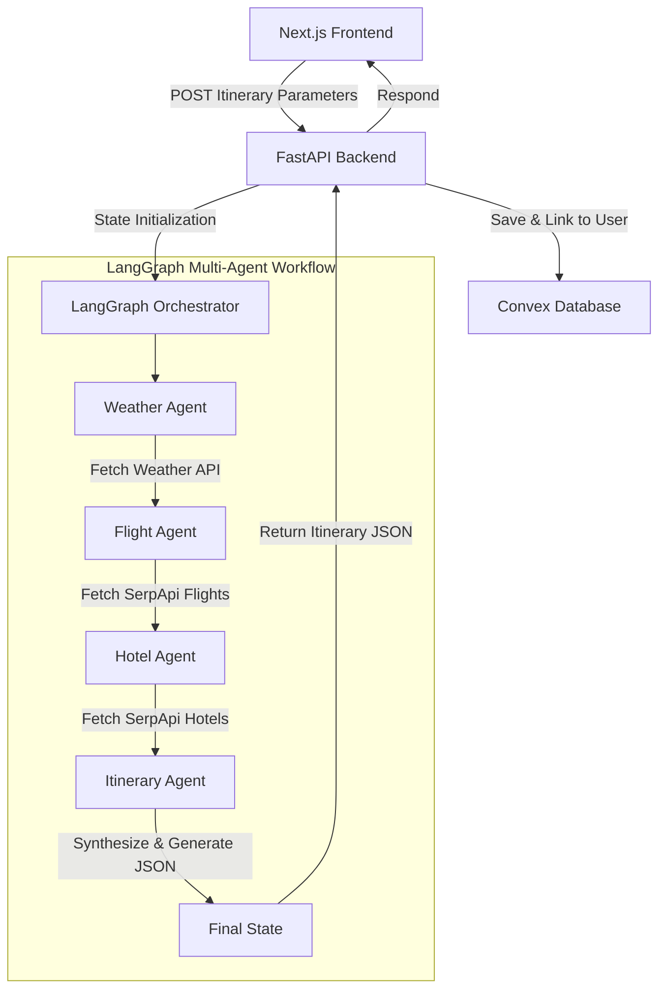

# AI-Powered Multi-Agent Travel Planner

An advanced, full-stack travel planning application powered by a custom multi-agent LangGraph system that automates destination research, lodging lookups, flight aggregation, and day-by-day itinerary synthesis based on user constraints, travel companions, and dynamic budgets.

---

## 🚀 Key Features

* **Multi-Agent Orchestration**: Powered by a stateful **LangGraph** workflow in Python coordinating concurrent agents (Weather, Flights, Hotels, and Itinerary builder) utilizing **Gemini 2.5 Flash** for dynamic synthesis.
* **Live API Integrations**: Integrates OpenWeatherMap and SerpApi (Google Flights & Google Hotels) to fetch live real-time pricing and conditions.
* **Flexible Flights Engine**: Supports both **one-way and round-trip** flight aggregation, using geographical coordinate solvers to automatically route suburban regions (e.g., Navi Mumbai, Noida, Gurgaon) to their nearest active commercial airport hubs (e.g., BOM, DEL) within a 150km radius.
* **Dynamic Travelers Form**: Expands to collect traveler ages and genders for Couples, Groups, and Families to accurately calculate weighted budget estimations.
* **Timeline Lodging & Dining**: Detailed interactive timeline detailing daily stay locations (🏨 Lodging) and custom meal plans (🍽️ Breakfast, Lunch, Dinner).
* **Cost Breakdowns**: Dynamic **Estimated Travel Budget** widget displaying flight, hotel, activity, and meal cost splits.
* **Voice Dictation**: Hands-free voice inputs utilizing the **Web Speech API** with custom browser-permission warning alerts.
* **Print-Specific PDF Export**: Tailored print-media styling (`@media print`) rendering a clean, high-contrast black-on-white printable booklet while hiding UI controls.
* **Database & Ownership Locks**: Managed via **Clerk** authenticated user states and object-level permissions, preventing unauthorized access to saved itineraries.
* **Live Admin Dashboard**: Interactive administrative directory listing real-time database accounts and saved trip counters.

---

## 🛠️ Technology Stack

### **Frontend (Next.js Application)**
* **Framework**: Next.js 16 (App Router) & React 19
* **Language**: TypeScript
* **Styling**: Vanilla CSS (sleek dark mode glassmorphism)
* **Auth**: Clerk Authentication
* **Mapping**: React Leaflet & Leaflet (OpenStreetMap coordinates)
* **Database**: Convex (real-time reactive database syncing client states)

### **Backend (Python Orchestrator)**
* **Framework**: FastAPI (Uvicorn server)
* **Workflow Engine**: LangGraph & LangChain
* **LLM**: Gemini 2.5 Flash (`gemini-2.5-flash`)
* **Local Database**: SQLite (SQLAlchemy ORM for quick caching)
* **APIs**:
  * **SerpApi**: Google Flights Engine & Google Hotels Engine
  * **OpenWeatherMap**: Current weather and conditions
  * **Nominatim**: OpenStreetMap geographical city search

---

## 📐 System Architecture

The travel planner utilizes a stateful multi-agent system coordinating independent data-gathering nodes before synthesizing the final itinerary:



### **Agent Explanations**
1. **Weather Agent**: Calls OpenWeatherMap API to get the current temperature and conditions at the destination.
2. **Flight Agent**: Identifies destination airport codes (resolving cities to their nearest active commercial airports) and pulls live flight schedules and prices (one-way or round-trip).
3. **Hotel Agent**: Queries live lodging prices matching the check-in/check-out calendar dates.
4. **Itinerary Orchestrator**: Aggregates all agent outputs, matches them against user budget constraints and companion preferences, and compiles them into a geographically precise day-by-day schedule.

---

## ⚙️ Environment Setup

Create a `.env.local` file in the root folder and a `.env` file in the `backend/` folder.

### **Next.js (`.env.local`)**
```env
NEXT_PUBLIC_CLERK_PUBLISHABLE_KEY=your_clerk_publishable_key
CLERK_SECRET_KEY=your_clerk_secret_key
NEXT_PUBLIC_CLERK_SIGN_IN_URL=/sign-in
NEXT_PUBLIC_CLERK_SIGN_UP_URL=/sign-up
NEXT_PUBLIC_CLERK_AFTER_SIGN_IN_URL=/
NEXT_PUBLIC_CLERK_AFTER_SIGN_UP_URL=/
NEXT_PUBLIC_CONVEX_URL=your_convex_url
NEXT_PUBLIC_MAPBOX_ACCESS_TOKEN=your_mapbox_token
GEMINI_API_KEY=your_gemini_api_key
ARCJET_KEY=your_arcjet_key
RESEND_API_KEY=your_resend_api_key
```

### **FastAPI Backend (`backend/.env`)**
```env
OPENWEATHERMAP_API_KEY=your_openweathermap_key
SERPAPI_API_KEY=your_serpapi_key
GEMINI_API_KEY=your_gemini_api_key
```

---

## 🏃 Running Locally

### **1. Setup Convex Database**
Ensure you have the Convex server running:
```bash
npx convex dev
```

### **2. Run Next.js Frontend**
Install dependencies and run the development server:
```bash
npm install
npm run dev
```
Open [http://localhost:3000](http://localhost:3000) in your browser.

### **3. Run FastAPI Backend**
Navigate to the `backend/` folder, activate your virtual environment, install requirements, and run the server:
```bash
cd backend
source venv/bin/activate  # On Windows: .\venv\Scripts\activate
pip install -r requirements.txt
uvicorn main:app --reload
```
The API server will run at [http://127.0.0.1:8000](http://127.0.0.1:8000).

---

## 🌐 Deployment & Hosting

* **Frontend Application**: Hosted on **Vercel Cloud**, leveraging edge serverless execution for high-speed page delivery and API proxy routing.
* **Database & BaaS**: Powered by **Convex Cloud** for live reactive database synchronization and **Clerk** for user authentication management.
